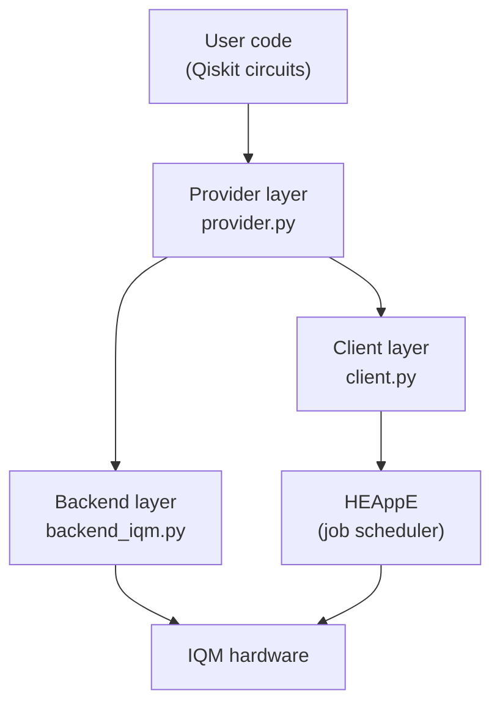

# Architecture

## Layer design

QaaS is structured as three layers:

### Provider layer (`provider.py`)

Authenticates against the LEXIS platform using the supplied token and project name, then resolves the requested resource to a concrete backend implementation. This is the only layer the user interacts with directly.

### Client layer (`client.py`)

Handles HEAppE job lifecycle: submission, polling, result retrieval, and error propagation back to the caller. Internally manages encrypted credentials and accounting information.

### Backend layer (`backend_iqm.py`)

Creates IQM-specific `QBackend` instances. Fetches real-time hardware calibration data, drives circuit transpilation through the IQM gate set, and wraps raw IQM results into the `QJob`/result abstraction.

## HEAppE execution flow

Jobs travel through the following steps once `backend.run()` is called:

1. **Submission** — circuit and parameters are packaged into a HEAppE command template and submitted.
2. **Initialisation** (`run_init.sh`) — the remote environment is set up; hardware availability and system information are verified.
3. **Execution** (`run_execution.sh`) — the quantum circuit is dispatched to IQM hardware and run for the requested number of shots.
4. **Result retrieval** — measurement counts are collected by HEAppE and streamed back to the QaaS client, which surfaces them via `job.result().get_counts()`.

## Key design decisions

- **Hardware-specific transpilation** is performed client-side before submission so that the backend always receives a valid native-gate circuit.
- **Real-time calibration** is fetched at backend creation time, ensuring transpilation targets the current hardware state.
- **IQM pulse-level optimisation** (`iqm-pulla`) is available as an optional post-transpilation step for advanced users.

## Roadmap

| Target | Item |
|--------|------|
| Q2 2026 | Low-level quantum circuit tuning |
